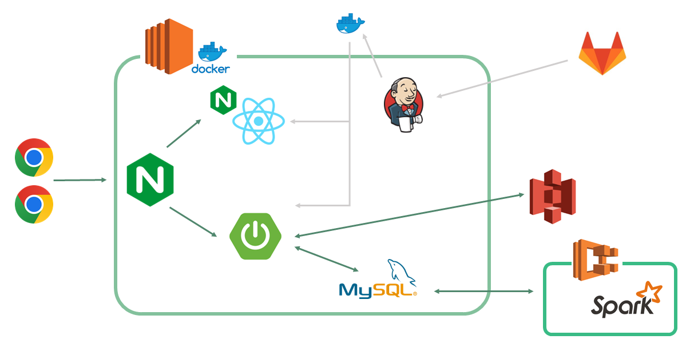
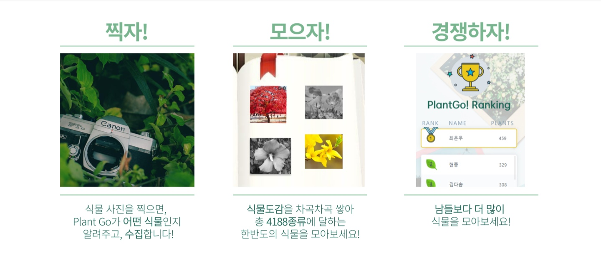

 

# 🌿 Plant Go! 🌿

- 나만의 식물도감 및 수집 서비스
- 삼성청년SW아카데미 7기 서울 특화 7반 A703 특화 프로젝트(빅데이터 분산)

 

# 🗓 프로젝트 기간

- 2022년 8월 22일 ~ 2022년 10월 07일

 

# 🛠 프로젝트 팀원

- #### **류인영** (팀장/데이터 분산)
- #### **김규란** (팀원/CI&CD, 데이터 분산)
- #### **배현중** (팀원/백엔드)
- #### **이재익** (팀원/프론트)
- #### **최은우** (팀원/프론트)

 

# 💻 기술 스택

 
</img>
 
</img>
 
</img>
</img>
</img>
</img>
</img>
 
 

 

# 🎮 협업툴

 

### <a href="https://www.notion.so/PlantGo-da7d1513eb2648ebbeb1d3d08a08e572"> 🌿 Plant Go! 노션 링크 </a>

 

# ⚙ 시스템 아키텍처

 

# 🎞 프로젝트 설명

 

# 🎞 실행 화면

- Main page
  - 소셜 로그인 구현 (카카오톡, 구글, 네이버)

 

- Map
  - 등록된 식물 마커 표시
  - 사진 조회
  - map 드래그, zoom in/out
  - 마커 클러스터링 구현

 

- Camera & Plant Information
  - 식물 사진 촬영
  - Plant.id API를 이용한 식물 정보 제공
  - 식물 사진 등록

 

- Plants Book
  - Collected/Uncollected 식물 조회
  - 무한스크롤 구현

 

- Ranking
  - 클러스터 서버, Spark를 이용한 분산 처리
  - 회원별 수집한 식물 종류 갯수 카운트
  - 상위 30위 랭킹 조회
  - 3분 간격으로 랭킹 갱신

 
